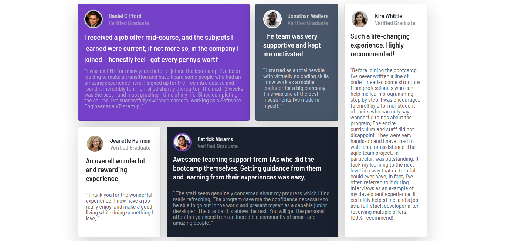

# Frontend Mentor - Testimonials grid section solution

This is a solution to the [Testimonials grid section challenge on Frontend Mentor](https://www.frontendmentor.io/challenges/testimonials-grid-section-Nnw6J7Un7). Frontend Mentor challenges help you improve your coding skills by building realistic projects. 

## Table of contents

  - [The challenge](#the-challenge)
  - [Links](#links)
  - [Built with](#built-with)
  - [Continued development](#continued-development)
  - [Useful resources](#useful-resources)

## Overview

### The challenge

Users should be able to:

- View the optimal layout for the site depending on their device's screen size

### Screenshot

### Links

- [Live demo](https://jeraldinnemg.github.io/testimonial-grid/)

## My process

### Built with

- Semantic HTML5 markup
- CSS custom properties
- Bootstrap 5

### Continued development

I'm a junior exploring technologies so I think there are a lot of ways to get the result! I would like to try the challenge with PURE Saas and CSS next time.

PD: Feel free to make suggestions!

### Useful resources

- [Bootstrap5-Docs](https://getbootstrap.com/docs/5.0/getting-started/introduction/) - Every single function I need to build this page were in Docs Guide!

### 
